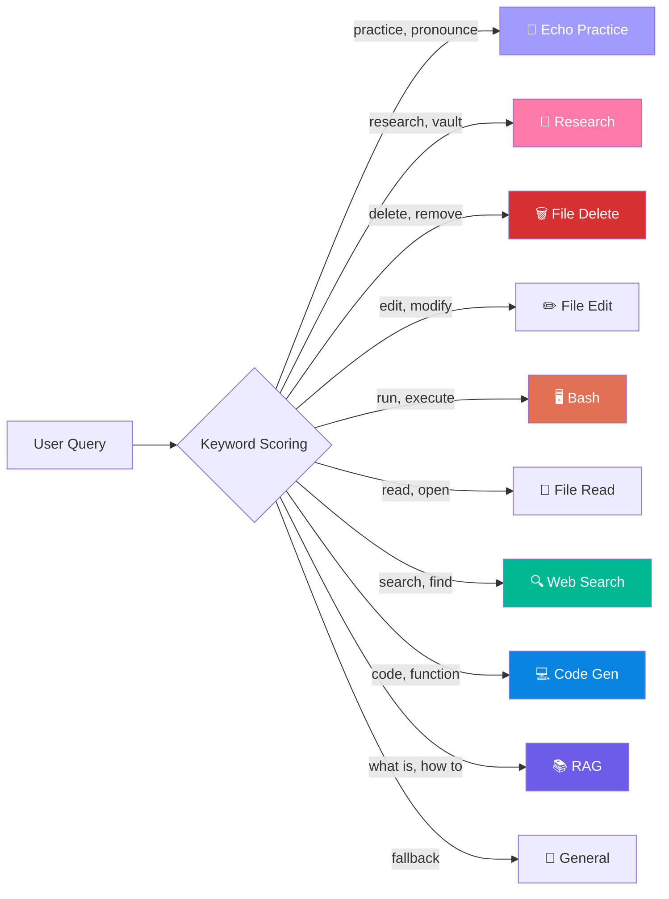
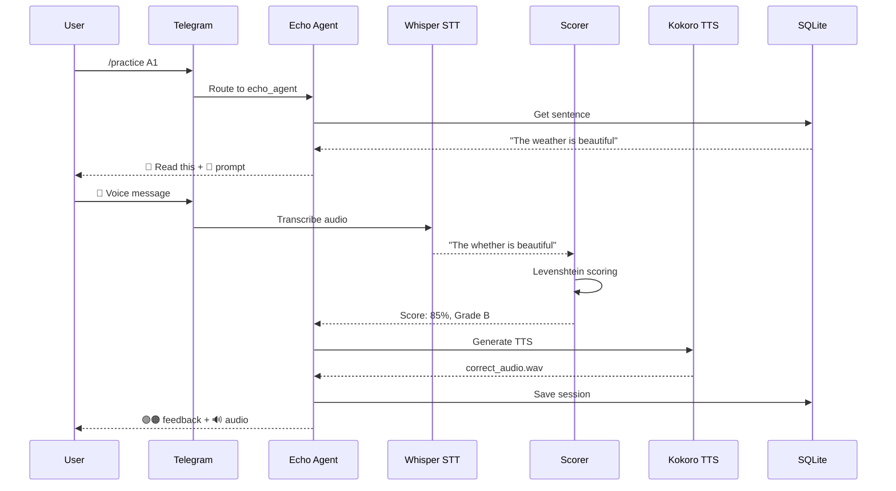
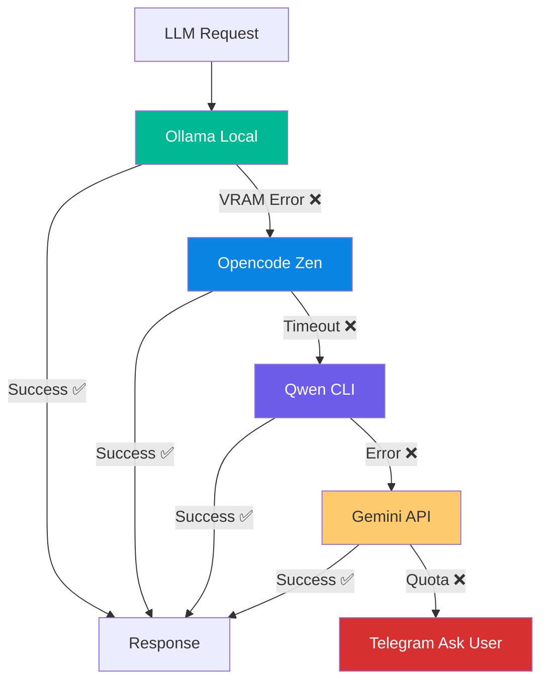
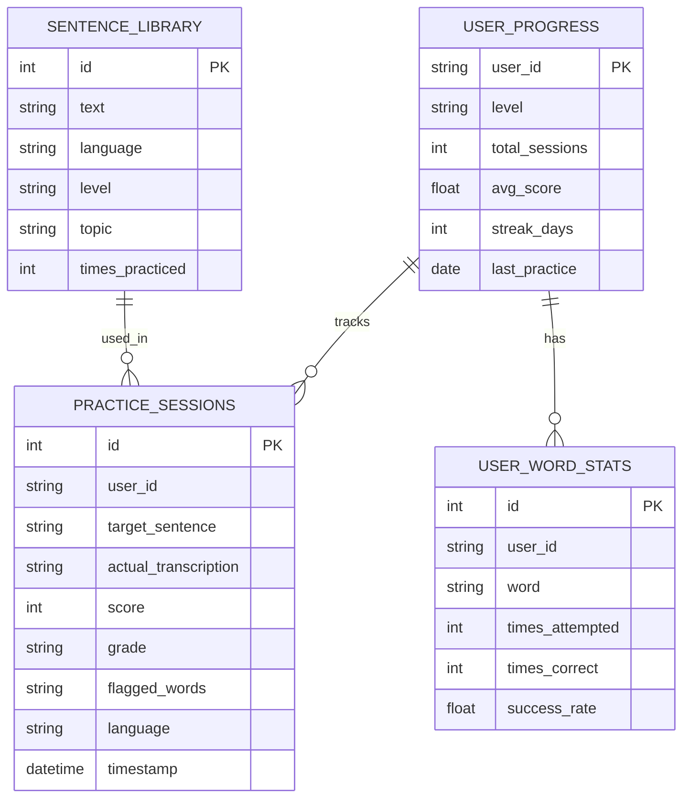

# 🧠 Metis — AI Agent Orchestrator

> LangGraph-powered AI assistant with Telegram, local LLMs, RAG, and Echo pronunciation practice.

[](LICENSE)
[](https://www.python.org/)
[](https://github.com/langchain-ai/langgraph)

## Architecture

```mermaid
graph TB
    subgraph "User Interfaces"
        TG[Telegram Bot]
        WEB[Gradio Web UI]
        CLI[CLI]
    end

    subgraph "LangGraph StateGraph"
        R[Router] --> RAG[RAG Agent]
        R --> CODE[Code Agent]
        R --> SEARCH[Search Agent]
        R --> FILE[File Reader]
        R --> EDIT[File Editor]
        R --> DELETE[File Deleter]
        R --> BASH[Bash Agent]
        R --> ECHO[Echo Agent]
        R --> RESEARCH[Research Agent]
        R --> GEN[General Agent]
        
        RAG --> FMT[Formatter]
        CODE --> FMT
        SEARCH --> FMT
        FILE --> FMT
        EDIT --> FMT
        DELETE --> FMT
        BASH --> FMT
        ECHO --> FMT
        RESEARCH --> FMT
        GEN --> FMT
    end

    subgraph "AI Services"
        OLLAMA[Ollama Local LLMs]
        KOKORO[Kokoro TTS]
        PIPER[Piper TTS]
        DUCK[ DuckDuckGo Search]
        CHROMA[(ChromaDB RAG)]
    end

    subgraph "Data Layer"
        TEL[(Telemetry SQLite)]
        SCHED[(Schedules SQLite)]
        ECHO_DB[(Echo SQLite)]
        LOCK[Singleton Lock]
    end

    TG --> R
    WEB --> R
    CLI --> R
    
    RAG --> CHROMA
    CODE --> OLLAMA
    SEARCH --> DUCK
    ECHO --> WHISPER[Whisper STT]
    ECHO --> KOKORO
    
    RAG --> TEL
    CODE --> TEL
    SEARCH --> TEL
    ECHO --> ECHO_DB
    BASH --> TEL

    style R fill:#ff6b6b
    style FMT fill:#4ecdc4
    style ECHO fill:#a29bfe
    style OLLAMA fill:#fdcb6e
    style KOKORO fill:#00b894
```



## Features

### 🔀 10-Route Intelligent Router

Metis classifies every message into specialized agents using keyword scoring:



### 🎤 Echo Pronunciation Practice

Built-in pronunciation coaching using local AI:



### 🤖 AI Fallback Chain

5-tier fallback ensures reliability:



### 📊 Database Schema



## Quick Start

### Prerequisites

- Python 3.12+
- [Ollama](https://ollama.ai/) with models loaded
- Telegram Bot Token (from @BotFather)

### Installation

```bash
# Clone repo
git clone https://github.com/G10hdz/Metis.git
cd Metis

# Setup virtual environment
python -m venv .venv
source .venv/bin/activate

# Install dependencies
pip install -r requirements.txt

# Copy and configure environment
cp .env.example .env
# Edit .env with your Telegram token and settings
```

### Configuration

```env
# Required
TELEGRAM_TOKEN=your-bot-token-from-botfather
ALLOWED_CHAT_IDS=your-telegram-chat-id

# Ollama
OLLAMA_BASE_URL=http://localhost:11434
METIS_ROUTER_MODEL=phi3:mini
METIS_CODE_MODEL=qwen2.5-coder:7b
```

### Run

```bash
# Interactive mode
python -m src

# Background service (Linux)
systemctl --user start metis-bot.service

# View logs
journalctl --user -u metis-bot.service -f
```

## Telegram Commands

| Command | Description |
|---------|-------------|
| `/practice [level] [lang]` | Start pronunciation practice |
| `/practice: <text>` | Practice custom sentence |
| `/progress` | View your Echo stats |
| `/speak <text> --lang es` | Text-to-speech |
| `/run <query>` | Execute in background |
| `/status` | Bot status |
| `/schedule` | Create scheduled task |
| `/capabilities` | Interactive manual |
| `/help` | Show help |

## Echo Practice Flow

1. **Start practice**: `/practice A1` or `/practice: The quick brown fox`
2. **Read aloud**: Bot sends target sentence
3. **Send voice**: Record and send voice message
4. **Get feedback**:
   - 🟢 Correct pronunciation
   - 🟠 Partial (close but not exact)
   - 🔴 Incorrect (needs practice)
5. **Listen**: Bot sends correct pronunciation audio
6. **Retry**: Send another voice message or get new sentence

### Example Session

```
You: /practice

Bot: 📖 Read this:

     "The comfortable chair was near the door"
     
     Now send a 🎤 voice message reading it aloud!

You: [sends voice message]

Bot: 🌟 Score: 85% (Grade: B)

     🟢 the 🟠 comfortable 🟢 chair 🟢 was
     🟢 near 🟢 the 🟢 door
     
     Words to practice:
     • comfortable → you said: comfortble
     
     🔊 [Correct pronunciation audio]
     
     🔄 Want to try again? Send another voice message.
```

## Project Structure

```
Metis/
├── src/
│   ├── echo/              # Pronunciation practice engine
│   │   ├── scorer.py      # Levenshtein scoring
│   │   ├── stt.py         # Whisper STT
│   │   ├── tts.py         # Kokoro TTS
│   │   └── database.py    # Progress tracking
│   ├── graph/             # LangGraph StateGraph
│   │   ├── orchestrator.py
│   │   ├── nodes.py       # All agent nodes
│   │   └── state.py       # Pydantic state model
│   ├── telegram/          # Telegram bot
│   ├── tts/               # Text-to-speech
│   ├── memory/            # RAG with ChromaDB
│   ├── scheduler/         # APScheduler tasks
│   ├── telemetry/         # Conversation logging
│   ├── utils/             # Fallback chain, VRAM guard
│   └── web/               # Gradio web UI
├── tests/                 # Pytest test suite
├── scripts/               # Service management
└── .env.example           # Configuration template
```

## Tech Stack

| Layer | Technology |
|-------|-----------|
| **Orchestration** | LangGraph StateGraph |
| **LLMs** | Ollama (phi3, qwen2.5-coder) |
| **Fallbacks** | Opencode Zen, Qwen CLI, Gemini API |
| **Messaging** | python-telegram-bot v21+ |
| **STT** | faster-whisper (Echo) |
| **TTS** | Kokoro + Piper |
| **RAG** | ChromaDB vector store |
| **Search** | DuckDuckGo API |
| **Database** | SQLite (3 stores) |
| **Web UI** | Gradio |
| **Scheduling** | APScheduler |

## Development

### Run Tests

```bash
python -m pytest tests/ -v
```

### Add New Route

1. Add route constant in `src/graph/nodes.py`
2. Add keywords to router
3. Create agent node function
4. Register in `src/graph/orchestrator.py`

## License

MIT License — see [LICENSE](LICENSE)

## Acknowledgments

- [LangGraph](https://github.com/langchain-ai/langgraph) for StateGraph orchestration
- [faster-whisper](https://github.com/SYSTRAN/faster-whisper) for STT
- [Kokoro](https://github.com/hexgrad/kokoro) for TTS
- [Ollama](https://ollama.ai/) for local LLM inference
